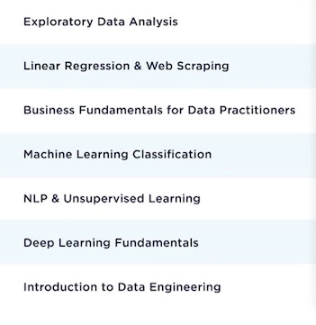

# Guia de estudos Data Science

Ordem das coias para estudar.

* Exploratory Data Analysis
* Linear Regression 
* Web Scraping
* Business Fundamentals for Data Practitioners
* Machine Learning Classification
* NLP & Unsupervised Learnig
* Deep Learning Funtamentals
* Introduction do Data Enginnering

