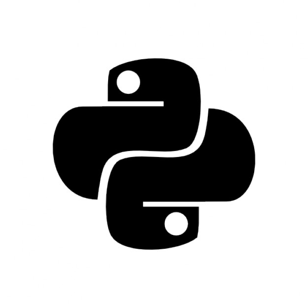

# Mudança. Porque não gostamos de mudar?

Mudar é uma coisa estranha, ao mesmo tempo em que todos concordam que mudar é bom, não há ninguém na face da terra que não sinta receio em mudar.

Talvez uma exceção seja, quando mudar significa adquirir mais coisas. Mudar/trocar de casa e de carro são vistos com bons olhos e adquirir/comprar coisas remete a ascensão, crescimento pessoal. Nesse momento, mesmo que o indivíduo esteja com receio de mudar ele é impulsionado por uma massa de outros indivíduos que acham que isso significa crescimento.

Claro, não estou dizendo que trocar de carro e comprar uma casa \(as custas de um bloco de boletos maior que a bíblia\) seja ruim, se você tem o dinheiro e é o que você quer vá em frente. Só quero dizer que mudar dói, ou pelo menos causa um arrepio na espinha, mesmo quando todos a sua volta concordam.

O interessante é que esse pensamento me veio ao ler um texto escrito pelo **Aaron Maxwell** da newsletter do site [powerfulpython.com.](https://powerfulpython.com/blog/gratitude-and-guido/) No texto ele conta o porque dele defender a mudança do Python 3 contra o Python 2. Na época diz ele \(por volta de 2013\), todos diziam que era só fazer um Python 2.8 e todos os seus problemas estariam resolvidos. Nessa época o Python 3 ainda era novo e por não ser\(e nunca vai ser\) totalmente retrocompatível com a versão anterior quebrava muito código e os programadores estavam com receio de migrar para a nova versão e ter que rescrever muita coisa, além de novos eventuais bugs que apareceriam pelo caminho.

Mas foi a defesa do **Aaron** que me fez pensar. Ele levanta a hipótese de que se o **Guido van Rossum**, criador da linguagem que todos usam e amam, não queria que todos usassem a nova versão? E se ele não quisesse isso porque criou uma nova versão da linguagem?

Um ótimo argumento, porém vai sempre esbarrar na parte da mudança, o Python 2.7 era muito bom e praticamente todos estavam contentes com ela, mudar para uma que não era igual, mas era a mesma ou quase isso \(risos\), daria uma quantidade de trabalho que os programadores ao redor do mundo não queriam ter, mudar ia doer e em alguns casos, doer muito.

Eu meio que vivi essa transição do Python 2 para o Python 3, mas eu estava em fase de aprender a linguagem então não tive muito o que pensar, fui logo na mais nova, o problema era que muitos livros\(leia-se torrents\) e tutoriais aos quais eu tinha acesso eram do Python 2\(que me ajudaram muito também\), então quando eu achava algum bom conteúdo sobre Python 3 lia de cabo a rabo \(bons tempos\).

Mas como o assunto é mudar e não programar, podemos ver que a mudança pode ocorrer de duas maneiras. De dentro pra fora e de fora para dentro e cada uma delas podem ter os seus benefícios e os seus malefícios.

### De fora pra dentro.

Algumas vezes o universo nos compele a mudar, seja mudando de emprego porque o atual é uma merda, seja acabando o relacionamento por causa de uma traição, a mudança ainda nos causa uma dor e ou um desconforto.

Como não gostamos de mudar , mudar a força é uma coisa ainda pior. Mudar desta maneira vai causar mais dor, mais sofrimento \(término por força maior de relacionamentos e mais desconforto do que que gostaríamos de ter.

No final vamos sair mais fortalecidos, e talvez com o tempo nos esqueçamos da lição e fatalmente cometeremos os mesmo erros de antes. É a vida. Aprendemos a nos levantar dos quedas que levamos, mas precisamos treinar bastante para não cair mais.

### De dentro pra fora

Essa forma de mudança é complicada, pois ao contrário da anterior ela precisa que o indivíduo empregue, voluntariamente, energia e tempo para iniciar e/ou concluir a mudança.

Seja para aprender algo ou mudar a composição corporal, não tenha dúvida que só você pode fazer isso por você mesmo.

O livro não vai ser lido sozinho, o exercício não se auto exercitar.... bem, acho que você pegou o jeito da coisa.

Então pessoa imaginária que está lendo esse texto, mudar de dentro para fora requer disciplina, é preciso querer é precisar mudar criar ou mudar um hábito. E como toda mudança nós não sabemos no que vai dar \(certo ou errado\), mas precisamos começar.

### História rápida sobre como mudar.

Alguns dos problemas de mudar \(sua vida, rotina o que for\) são as formas de começar. Eu tenho um jeito direto de começar alguma coisa. Simplesmente começo no momento que eu decido que vou fazer. Quando me tornei vegano foi uma dessas vezes.

Estava eu flertando com a possibilidade de virar vegetariano quando achei o termo vegano que é um tipo bem mais radical de vegetariano, pois um veganismo não é apenas sobre não comer carne, é entender que os animais também sentem dor, medo, amor e que não é necessário assassina-los para se ter uma boa alimentação. Então eu falei pronto, sou vegano.

No outro dia foi aniversário do meu filho onde tinha muitas comidinhas de aniversário \(bolo, brigadeiro etc\) e eu já comecei nesse dia tendo que explicar muitas vezes o que era ser vegano e porque eu não estava comendo nada. Desse dia pra cá já fazem mais de 9 anos.

Bom resumindo se eu falar que vou começar alguma coisa, não vai ser na segunda-feira que vem ou no começo do mês, vai ser agora, assim dói menos, pelo menos pra mim. Até próxima.

