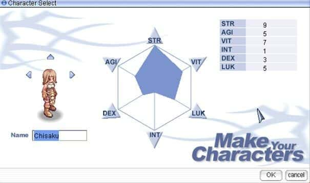

# Ninguém gosta do equilíbrio.

Equilíbrio, todos querem, mas será que gostamos? Será que cultuamos pessoas que têm uma vida equilibrada? Nossos ídolos, pessoas de sucesso \(~~o que é sucesso~~\), são equilibradas?

Na minha opinião a vida parece com um tabuleiro de RPG onde o mestre não existe ou você mesmo vai mestrando de acordo com a sua vivência. E assim como nos RPGs você tem os seus pontos de atributos que conforme vai ganhando vai gastando em coisas que te interessam. O problema é que sempre vão existir coisas \(atributos\) aos quais você quer fazer ou ganhar, que são antagonistas a outras. 

Um dos grandes dilemas da vida é se dedicar a alguma coisa e ser bom \(muito bom\) nela. Se você quiser ser o melhor, vai ter que dedicar muito tempo a essa habilidade e como sabemos o tempo é limitado, não importa o quão organizado  _workaholic_ você é, o seu dia vai ter apenas 24 horas.

E são nessas 24 horas que a vida acontece, seja aqui ou na China, não dá para comprar mais tempo. Cada minuto empenhado em alguma coisa é um minuto a menos em que passaremos fazendo outra. 

A imagem abaixo mostra o gráfico do Jogo _Ragnarok Online_ \(RO\). Cada vez que um jogador sobe de nível ele recebe uma quantidade de pontos que podem ser distribuídos entre os vários atributos, mas como na vida não conseguimos maximizar todos os atributos, os pontos são limitados e em alguns casos antagônicos. Nesse jogo por exemplo _STR_ \(força\) e _INT_ \(inteligência\) são contrários, pois _STR_ é muito bom para um guerreiro que luta de espada ou corpo a corpo, e o atributo inteligência é relacionada personagens que usam magia , um mago por exemplo necessita mais do atributo intelig\|ência do que um espadachim, por exemplo.

Então assim como em um bom RPG não dá para maximizar a vida. Para todas as nossas decisões temos que ter concessões, para ser muito bom em alguma coisa, você tem que ser ruim em outra.

Portando nosso ídolos, que provavelmente são muito bons em alguma área que prezamos, provavelmente não são bons ou são péssimos em outras. Não é difícl encontrar relatos de personalidades famosas sejam elas cientistas, atores ou atrizes, músicos e etc, que tenham sido "endeusados" pela sua fama de serem bons pais e/ou pessoas de caráter exemplar?

Você que gostava/gosta do Gun's and Roses ou do Nirvana por causa da música, provavelmente não aprovava \(vai saber né?\) as overdoses que eles tiveram.

  

